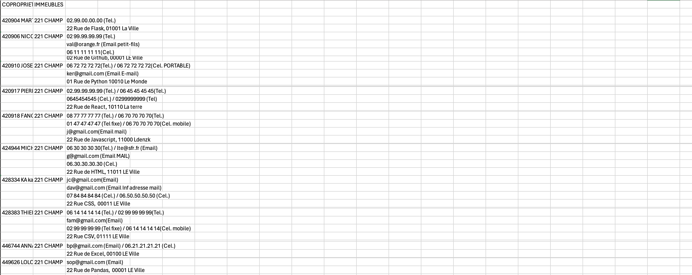
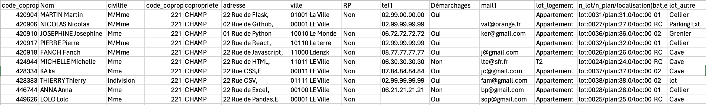

# [listexcel.fr](listexcel.fr)
Application web créée pour gérer les données extraites du logiciel ICS (logiciel pour les syndics de copropriété et pour la gestion locative). Sur ICS lorsque l'on souhaite extraire les données clients en tableau excel voici ce que l'on obtient :

Tableau après traitement :

## Avertissement
Les données extraites d'ICS sont sensibles. Ce projet s'inscrit dans une démarche d'apprentissage du developpement informatique. Il est vivement déconseillé de l'utiliser pour le traitement des données de votre entreprise.

## Demo
### Extraitres les données d'ICS 
[Exporter liste copropriétaires d'ICS vers Excel](https://youtu.be/-_pPqSnMloM?si=u34BExqOe_bRhbBZ)

[Exporter liste lots d'ICS vers Excel](https://youtu.be/GLNXAol1ad0)

### Pour tester mon application : 
- Rendez-vous sur [listexcel.fr](listexcel.fr)
- Créez-vous un compte 
- Dans 'Créer une liste' : 
    - Transmettez ce fichier : [Liste_Ics.csv](/DEMO/Liste_Ics.csv)

    Ensuite : 
    - Si vous faites 'oui', alors vous pouvez, par exemple, inscrire : 01 Rue de Python 10010 Le Monde
    Puis : 
    - Transmettez ou non ce fichier : [Lots.csv](/DEMO/Lots.csv)
Vous obtenez alors votre liste. Vous vous appropriez cette liste que vous modifiez. Vous vous retrouvez avec cette nouvelle liste : [liste_user.csv](/DEMO/liste_user.csv)
- Dans 'Mettre à jour liste' : 
    - Vous pouvez transmettre liste_user et cette liste extraite d'ICS : [Liste_Ics.csv](/DEMO/Liste_Ics.csv)
    - Puis, sur la page suivante cette liste des lots : [Lots.csv](/DEMO/Lots.csv)
Les informations que vous avez ajoutées sont conservées, tout en remettant à jour les coordonnées et les copropriétaires. 

Le VPS supprime les fichiers toutes les heures. 

    

## Fonctions :
- Créer un tableau Excel lisible : 
    - Organisation des données par colonne, 
    - Trie des informations supperflues,
    Ajout possible : 
    - Detection automatique: Résidence Princiaple (Oui/Non),
    - Lots principaux et annexes et localisation dans l'immeuble,
- Mise à jour de votre fichier :
    - Supression des propriétaires ayant vendus et ajout des nouveaux, 
    - Mise à jour des informations de chaque propriétaires,
    - Conserve votre mise en page : 
        - ajout ou suppression de colonne
=> Ce site ne conserve aucunes données, les fichiers partagés sont supprimés au bout d'un certain temps. 

## Apprentissage
Avec ce projet j'ai pu réutiliser le framework flask, déjà vu grâce à CS50. Mais surtout j'ai découvert :
- La librairie Pandas, 
- La gestion des users,
- La gestion des fichiers, 
- Le déploiement d'une application web sur un VPS, 
- La sécurisation d'un VPS. 

